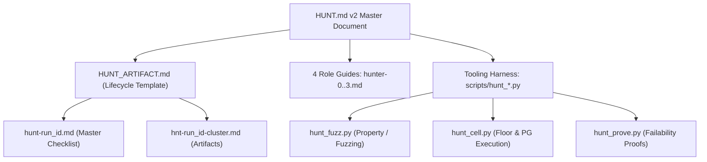

# Adversarial review: HUNT.md v2 refactor plan (HUNT2.md)

Date: 2026-09-14. Reviewed [docs/bug_hunt/HUNT2.md][hunt2] against the existing [docs/bug_hunt/HUNT.md][hunt],
the gold-standard feature agentflow [docs/builder/BUILD.md][build], [AGENTS.md][agents],
[docs/bug_hunt/pbugs.md][pbugs], and root [vulns.md][vulns].

No `pytest` command was run. The repository instructions reserve pytest for an explicit request.

## 1. Executive Verdict

**Reject in current form.** While [HUNT2.md][hunt2] provides a forensic, devastatingly accurate
diagnosis of why the 0.0.13--0.0.15 bug hunts failed, its proposed solution retreats into
**procedural paralysis, tooling defeatism, and architectural half-measures**.

Specifically:
1. **It repeats the builder's fatal role-coupling anti-pattern.** By leaving Worker 1 as both
   "hunter" (adversarial breaker) and "implementer" (systemic surgeon), it preserves the very
   incentive structure that produced 45 shallow `try/except` containment band-aids in 0.0.15.
   Furthermore, Worker 2 only verifies contract compliance; nobody reviews W1's diff for code
   quality, DRY adherence, performance regressions, or fail-open expressions.
2. **It retreats from 3rd-party tooling instead of integrating it.** The maintainer asked for a
   robust engine, "maybe an integration with a 3rd party plugin or something, like a library to help
   agents find bugs." [HUNT2.md][hunt2] Section 3.5 waves this off as "an integration choice, not an
   oracle" and bans all plugins from the pilot. Human and LLM agents suffer from cognitive
   anchoring; without automated property generation (Hypothesis), schema fuzzing
   (hypothesis-graphql/schemathesis), or mutation analysis (mutmut), agents will test only the
   happy-path variations they can easily imagine.
3. **It creates a "Pilot-First" deadlock.** Section 4 declares: "Nothing in sections 5 or 6 is built
   until this deliverable is accepted and the pilot has run." Yet running the pilot requires
   building a bespoke runner with 9 custom rejection criteria, solving multi-cell Postgres
   orchestration, and hand-authoring stateful test oracles---all without an approved agentflow
   instruction file.
4. **The "Error-Contract Table" is a phantom.** Principle 1 commands workers to cite "the row of
   the error-contract table that governs it," but [HUNT2.md][hunt2] never writes the table.
   Instructing agents to consult an unwritten taxonomy guarantees arbitrary classifications.
5. **It lacks an Artifact-as-Contract architecture.** [BUILD.md][build] succeeds because every
   work unit is governed by a formal artifact ([ARTIFACT.md][artifact], `bld-<NNN>-*.md`) with
   strict `Status:` transitions, failability proofs, and role ownership partitions. [HUNT2.md][hunt2]
   abandons the 96-item flat checklist but provides no concrete artifact specification to replace it.

To rebuild `HUNT.md` "in the same way as `BUILD.md`," the agentflow must adopt [BUILD.md][build]'s
4-role isolation, its artifact state machine, mechanized failability proofs, and a real tooling
harness.

---

## 2. Adversarial Breakdown of HUNT2.md

### Finding 1: The W0/W1/W2 Role Allocation Recreates the Author-Reviewer Flaw

[HUNT2.md][hunt2] proposes a three-role model (Principle 9):
- **W0**: Mechanical coordinator and workspace supervisor.
- **W1**: "Investigates and implements only confirmed, authorized fixes."
- **W2**: Substantive verifier who checks contract and reproducer before reading W1's diagnosis.

#### Why this breaks down:
1. **Breaker and Fixer cannot be the same agent.** When W1 is responsible for both discovering the
   bug and implementing the fix, W1 is heavily incentivized to discover bugs that are cheap and easy
   to fix (e.g. converting a raw `TypeError` to a `FieldError` with a one-line `try/except`). Deep,
   systemic defects (such as cross-model authorization leaks, multi-DB lock leaks, or lifecycle
   mismatches) require extensive architectural surgery. An agent will unconsciously avoid reporting
   bugs that demand massive diffs if that same agent must write, test, and justify the fix.
2. **Who performs the code review and DRY audit?** In [BUILD.md][build], Worker 2 builds and
   Worker 3 reviews. Worker 3 audits the diff for DRY violations, control-flow hotspots, fail-open
   shapes (`BUILD.md` #"Fail-open shapes"), and N+1 query regressions. In [HUNT2.md][hunt2], W2 is a
   *functional verifier* (checking if the bug reproduces and if the fix closes it), NOT a code
   reviewer. Who ensures W1's fix didn't duplicate a helper across 3 files, introduce an unindexed
   query, or leave a fail-open `or` clamp?
3. **The required 4-role structure (modeled on `BUILD.md`):**
   - **Hunter 0 (Coordinator & Pre-flight Supervisor)**: Dispatches scenarios, verifies isolated
     workspace cleanliness, enforces runner invariants, maintains campaign state.
   - **Hunter 1 (Adversary / Breaker / Fuzzer)**: Pure breaker mindset. Uses fuzzing, property tests,
     and boundary probes. Deliverable: minimal reproducer, trace, and violated contract citation.
     *Hunter 1 is strictly forbidden from editing production code.*
   - **Hunter 2 (Architect / Implementer)**: Receives the verified reproducer from H1. Identifies the
     root cause, performs the surgical fix at the owning layer, and writes the permanent regression test.
   - **Hunter 3 (Auditor / DRY Reviewer / Matrix Verifier)**: Independently re-runs the reproducer on
     the unpatched tree to confirm failability, runs the patch on all target cells (including the
     Django 5.2 / Python 3.10 floor), audits the diff for DRY violations and fail-open shapes, and
     validates `fail_under = 100`.

---

### Finding 2: Tooling Defeatism Leaves Agents Cognitively Blind

[HUNT2.md][hunt2] Section 3.5 treats 3rd-party tools and plugins as an afterthought:
> *"A third-party plugin or hosted scanner is an integration choice, not an oracle... No plugin is
> needed to start the pilot."*

This dismissive stance contradicts both the maintainer's explicit request and empirical reality.

#### Why manual agent probing fails:
- **Agents suffer from cognitive path-dependence.** Left to write scratch tests by hand, an LLM agent
  writes 5 to 10 permutations of inputs it can conceptualize (passing `None`, empty string `""`,
  oversized integers, special characters). It cannot explore the $10^6$ state space of deeply nested
  GraphQL selections, interleaved async cancellations, or complex filter combinators.
- **Why prior hunts found only containment bugs:** In 0.0.15, 45 of 52 fixes were local input
  coercion. That happened precisely because agents had no instruments to fuzz the GraphQL boundary
  or mutate code invariants!

#### What an integrated tooling suite must provide:
1. **Property-Based Testing (Hypothesis & hypothesis-graphql / Schemathesis):**
   - [HUNT2.md][hunt2] Principle 3 correctly warns about state contamination in Django under
     Hypothesis. But the answer is not to ban Hypothesis from the pilot; the answer is to provide a
     standardized transactional test wrapper (`scripts/hunt_fuzz.py`) that uses `TestCase`
     transaction rollbacks and clean `TestClient` resets between examples.
   - Instead of inventing 20 manual GraphQL documents, Hunter 1 runs:
     `uv run python scripts/hunt_fuzz.py --scenario pagination --examples 500`
     which feeds valid and invalid AST queries into the live `/graphql` endpoint, asserting
     invariants (e.g., response status is 200/400, never 500; private fields never leak; cursor seek
     is monotonic).
2. **Mutation Testing as Defect Discovery (Mutmut):**
   - [HUNT2.md][hunt2] Principle 12 calls mutation testing a "pilot lead, not a per-item tax." In
     fact, mutation testing is the most powerful defect-discovery tool available.
   - If an agent wants to hunt `optimizer/lateral_fetch.py`, running `mutmut` reveals 12 surviving
     mutants where conditions were inverted and the test suite stayed green. Those 12 surviving
     mutants are not "taxes"---they are pre-packaged, mathematically proven bug leads handed to
     Hunter 1 on a platter!
3. **Targeted Static Invariant Scanners (Ruff S / Bandit / Semgrep):**
   - The High-severity defect in `mutations/permissions.py` was an unawaited coroutine evaluated as
     truthy (`if check_permission(): ...`). An AST scanner like Semgrep or Pyright can detect
     unawaited coroutines in boolean contexts repo-wide in 2 seconds.
   - Why wait for an agent to stumble across this in manual reading when an automated script can flag
     all 14 candidate sites immediately?

---

### Finding 3: The "Pilot-First" Gridlock vs. Executable Infrastructure

Section 4 states:
> *"Nothing in sections 5 or 6 is built until this deliverable is accepted and the pilot has run."*

Section 4.2 then sets up 9 runner rejection test cases that must be proven with fixtures before the
runner is accepted.

#### The flaw:
- This is textbook waterfall design. Who runs the pilot? What document guides the workers during the
  pilot? If `HUNT.md` v2 is not written until after the pilot (Section 5), the workers are running an
  unwritten agentflow!
- If the pilot requires building a custom runner, setting up isolated disposable workspaces, writing
  fixtures for 9 runner rejection edge cases, and configuring Postgres x multi-DB, the project will
  spend 3 weeks building testing infrastructure without hunting a single bug.
- **The BUILD lesson:** [BUILD.md][build] did not build all its mechanized tooling
  (`scripts/prove_failability.py`, `scripts/review_inspect.py`) before building Slice 1. It defined
  the worker roles, the artifact template, and the verification rules first, then mechanized
  repetitive steps as they stabilized.
- **Correction:** Write `docs/bug_hunt/HUNT.md` v2 and `docs/bug_hunt/HUNT_ARTIFACT.md` first. Treat
  the 3 scenarios in Section 4.1 as **Milestone 1 (The Calibration Campaign)** of the new agentflow,
  not as an ad-hoc pre-requisite.

---

### Finding 4: The Phantom Error-Contract Table

Principle 1 insists:
> *"An error-contract table replaces the blanket containment rule... before probing a boundary, the
> hunter records the row of the contract table that governs it: boundary, failure class, promised
> wire shape, masking, logging, rollback, and absence of unauthorized effects."*

#### The flaw:
- [HUNT2.md][hunt2] NEVER PROVIDES THIS TABLE. It cites [docs/README.md][readme], but [README.md][readme]
  is consumer documentation describing general behavior, not an exhaustive framework error taxonomy.
- Telling an agent to "record the row of the contract table" when no such table exists forces the
  agent to hallucinate a row or guess.

#### The required Framework Error Taxonomy (must be formalized in `HUNT.md` v2):

| Tier | Failure Class | Origin / Trigger | Promised Wire Response | Masking / Logging | State / DB Invariant |
|---|---|---|---|---|---|
| **E1** | Syntax / Parse / Coercion | Malformed GraphQL, unknown field, invalid scalar literal | HTTP 200, `data: null`, `errors: [{message, locations}]` (GraphQLError) | Never masked; logged at DEBUG | Zero DB queries, zero mutations executed |
| **E2** | Authentication / Global Authz | Unauthenticated actor on protected field, invalid JWT | HTTP 200, field `null`, `errors: [{message, code: "UNAUTHENTICATED"}]` | Never masked; logged at INFO/WARN | Read-only; transaction never opened |
| **E3** | Row-Level Visibility / Filter | Querying hidden rows or unauthorized relation | HTTP 200, field `null` or omitted from list; NO error emitted (indistinguishable from non-existence) | N/A (silent filter via sealed QuerySet) | No leaked PKs, existence oracles, or row counts |
| **E4** | Mutation Validation Error | Form / Serializer / Model validation failure (`clean()`) | HTTP 200, payload `errors: [{field, message}]`, `success: false` | Application envelope; never leaks top-level GraphQLError | Automatic atomic rollback; zero rows persisted |
| **E5** | Internal Unexpected Exception | Resolver bug, DB disconnection, deadlock, unhandled error | If `DEBUG=False`: masked as `INTERNAL_SERVER_ERROR`. If `DEBUG=True`: full traceback in extensions | Masked under `ErrorPolicy.MASK_ALL`; logged at ERROR with traceback | Atomic rollback of active transaction |
| **E6** | Transport / Protocol Violation | Body > cap (413), bad UTF-8 (400), CSRF failure (403) | HTTP 400 / 403 / 413 plain text/JSON; WS close 4400/4403 | Transport level; never reaches GraphQL engine | Request body stream unconsumed past cap |

---

### Finding 5: Unit of Work --- Subsystem Clusters vs. 96 Files vs. Unbounded Scenarios

- **The Failure of `HUNT.md` v1:** A flat linear sweep of 96 Python files. This forced agents to
  treat files in isolation, producing micro-fixes in leaf utilities while missing interaction bugs.
- **The Failure of `HUNT2.md`'s Proposal:** Section 3.1--3.2 proposes hand-authoring scenarios with
  formal oracles. But hand-authoring scenarios for 96 files requires writing dozens of comprehensive
  specifications with mathematical oracles. That human authoring tax ensures the hunt never scales.

#### The Solution: Subsystem Invariant Clusters
Instead of 96 single files or dozens of ad-hoc scenarios, partition `django_strawberry_framework/`
into **10 Subsystem Invariant Clusters**. Each cluster has an assigned boundary, entry points,
known failure modes from [pbugs.md][pbugs] and [vulns.md][vulns], and primary execution cells:

1. **Keyset & Pagination Engine**: `keyset.py`, `utils/connections.py`, `connection.py`,
   `optimizer/single_parent_fetch.py`. (Boundaries: cursor encryption, seek math, `UNSET` vs `None`,
   `NULL` collation order on SQLite vs Postgres).
2. **Type Registry & Schema Finalizer**: `registry.py`, `types/finalizer.py`, `types/base.py`,
   `schema.py`, `schema_reload.py`. (Boundaries: PEP 649 annotation synthesis, duplicate type
   handling, cross-test schema leakage, registry reset).
3. **Write Transactions & Mutation Lifecycle**: `utils/write_transaction.py`,
   `mutations/resolvers.py`, `forms/resolvers.py`, `rest_framework/resolvers.py`. (Boundaries:
   `select_for_update` on PG, lockless conflict on SQLite, multi-DB alias pinning, rollback on error).
4. **QuerySet Sealing & Permission Traversal**: `utils/querysets.py`, `permissions.py`,
   `utils/permissions.py`, `filters/sets.py`. (Boundaries: hostile manager returns, reverse relation
   traversal, async context decoding, coroutine truthiness).
5. **Optimizer & Compiler Surgery**: `optimizer/lateral_fetch.py`, `optimizer/nested_planner.py`,
   `optimizer/walker.py`, `optimizer/hints.py`. (Boundaries: Postgres LATERAL SQL emission,
   cross-parent partitioning, MTI joins, query plan downgrades).
6. **Transport, Body Cap & CSRF Boundaries**: `views.py`, `middleware.py`, `_request_body.py`.
   (Boundaries: chunked POST without `Content-Length`, UTF-8/BOM decoding, CSRF middleware order,
   sync/async parity).
7. **Session & WebSocket Lifecycle**: `utils/sessions.py`, `auth/sessions.py`, `consumers.py`,
   `auth/mutations.py`. (Boundaries: mid-stream session revocation, frame emission under expired lease,
   Channels scope spoofing).
8. **Relay GlobalID & Node Interfaces**: `relay.py`, `types/relay.py`, `types/node.py`. (Boundaries:
   GlobalID type confusion, cross-model PK collision, multi-type single-model resolution).
9. **Resource Policy & Execution Budgets**: `resource_policy.py`,
   `extensions/resource_policy.py`. (Boundaries: pre-parse token/depth scan vs named operation,
   `__dict__` mutation bypass, memoryview charging).
10. **Soft Dependencies & Public Surface**: `__init__.py`, `conf.py`, `utils/imports.py`,
    `_strawberry_patches.py`, `_django_patches.py`. (Boundaries: optional dependency absence,
    patch target movement across versions, `__all__` totality).

---

### Finding 6: The Failability Proof in Bug Hunting

In [BUILD.md][build], failability proofs (`scripts/prove_failability.py`) ensure that a test actually
fails when an invariant is removed.

In bug hunting, the relationship is inverted and even more critical:
- **The Reproducer IS the Failability Proof.**
- Under [HUNT.md][hunt] v1, agents routinely wrote tests that passed whether the bug was fixed or
  not, or claimed fixes that had never run.
- Under [HUNT2.md][hunt2], the reproducer requirement must be mechanized into an explicit 3-step
  verification gate:
  1. **Step 1 (Pre-Fix Demonstration):** Run the minimal reproducer against the unpatched code
     (`git show HEAD:<target>`). The reproducer MUST FAIL (exit code != 0) with the exact expected
     error/trace.
  2. **Step 2 (Post-Fix Verification):** Run the reproducer against the patched code. The reproducer
     MUST PASS (exit code == 0).
  3. **Step 3 (Revert/Mutation Check):** Transiently remove the fix or invert the condition using
     `scripts/prove_failability.py`. The reproducer MUST FAIL AGAIN, proving that the test is
     distinguishing and not vacuously green.

A bug is not accepted until all three steps are mechanically recorded in the scenario artifact.

---

### Finding 7: Matrix & Environment Realities Must Be Operationalized

[pbugs.md][pbugs] Item 11 proved that a bug (`is_forward_concrete_relation`) can hide under 100%
statement coverage on Python 3.14 / Django 6.1 / SQLite while being completely broken on Django 5.2.
[HUNT2.md][hunt2] Principle 11 recognizes this, but fails to provide a mechanism for local execution.

#### Operational requirements for `HUNT.md` v2:
1. **The Floor Environment Must Be Standardized:** Just as [BUILD.md][build] defines
   `## Floor verification` using an isolated venv (`<scratch>/floor-venv`), `HUNT.md` v2 must specify
   how Hunter 0 initializes the floor venv (Python 3.10 / Django 5.2.16 / strawberry 0.316.0) and
   requires Hunter 3 to run every reproducer in that venv.
2. **Postgres Harness for Sharding & Lateral Joins:**
   - SQLite makes `select_for_update` a silent no-op. Any concurrency or lock probe run on SQLite is
     worthless.
   - `HUNT.md` v2 must provide a script `scripts/hunt_cell.py` that executes a test file against a
     running Postgres instance (via `FAKESHOP_PG_DSN`) and detects whether Postgres is reachable. If
     Postgres is unreachable, the test is marked `BLOCKED: PG_UNAVAILABLE` rather than falsely
     passing on SQLite.

---

## 3. Concrete Action Plan: Rebuilding HUNT.md in the Same Way as BUILD.md

Instead of stalling behind an unwritten pilot, the maintainer should proceed directly to the
architectural refactor of the bug-hunt agentflow:

### Phase 1: Core Agentflow Documents
1. **`docs/bug_hunt/HUNT.md` v2:**
   - Define the 4-role allocation: Hunter 0 (Coordinator), Hunter 1 (Adversary/Breaker), Hunter 2
     (Implementer/Architect), Hunter 3 (Auditor/Matrix Verifier).
   - Adopt the 10 Subsystem Invariant Clusters as the standard campaign structure.
   - Incorporate the Framework Error Taxonomy (Tiers E1--E6) as the binding error contract.
   - Establish the 3-step Mechanized Reproducer Verification rule.
2. **`docs/bug_hunt/HUNT_ARTIFACT.md`:**
   - Standard template for all scenario artifacts (`hnt-<run_id>-<cluster_slug>.md`).
   - Strict `Status:` chain: `planned` -> `investigating` -> `reproduced` -> `fix-implemented` ->
     `verified` -> `closed` (or `no-findings`).
   - Role-specific sections: Hunter 1 writes the attack and reproducer; Hunter 2 writes the root-cause
     diagnosis and patch; Hunter 3 writes the matrix verification and failability proofs.
3. **Role Instruction Documents (`docs/bug_hunt/hunter-[0-3].md`):**
   - Concrete instructions, required reading, and spawn prompts for each of the 4 worker roles,
     mirroring `docs/builder/worker-[0-3].md`.

### Phase 2: Tooling & Matrix Harness
1. **`scripts/hunt_fuzz.py`:** Standardized property-based fuzzing wrapper using `hypothesis` and
   `fakeshop` test client, guaranteeing isolated database rollbacks.
2. **`scripts/hunt_prove.py`:** Automation of the 3-step bug verification (pre-fix fail, post-fix pass,
   revert fail).
3. **`scripts/hunt_cell.py`:** Multi-cell dispatcher executing reproducers against the floor venv
   (`<scratch>/floor-venv`) and Postgres.

### Phase 3: Milestone 1 Execution (The Calibration Campaign)
- Execute the 3 pilot scenarios from [HUNT2.md][hunt2] (Pagination window, Authorization visibility,
  Transaction lifecycle) using the newly drafted 4-role flow and tooling harness.
- Validate that Hunter 1 successfully finds defects without writing patches, Hunter 2 delivers clean
  architectural fixes, and Hunter 3 catches matrix discrepancies.

---

<!-- LINK DEFINITIONS -->

<!-- Root -->
[agents]: ../AGENTS.md
[goal]: ../GOAL.md
[start]: ../START.md
[vulns]: ../vulns.md

<!-- docs/ -->
[feedback]: feedback.md
[hunt]: bug_hunt/HUNT.md
[hunt2]: bug_hunt/HUNT2.md
[pbugs]: bug_hunt/pbugs.md
[readme]: README.md
[tree]: TREE.md

<!-- docs/SPECS/ -->

<!-- docs/builder/ -->
[artifact]: builder/ARTIFACT.md
[build]: builder/BUILD.md

<!-- django_strawberry_framework/ -->

<!-- tests/ -->

<!-- examples/ -->

<!-- scripts/ -->
[bug-hunt-script]: ../scripts/bug_hunt.py
[prove-failability]: ../scripts/prove_failability.py

<!-- .venv/ -->

<!-- External -->
